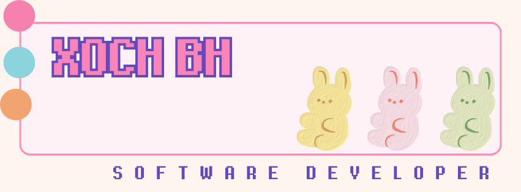

Hi My name is xoch
============================================================================================================================

Fullstack Developer
-------------------

- 🔭 I’m currently working on Javascript,Nodejs,Expressjs,React,aws cloud, google cloud.
- 🌱 I’m currently learning ... Python,sql, ibmcloud

# 💻 Tech Stack:
                 
# 📊 GitHub Stats:
 
 

---

<h3 align="left">Languages and Tools:</h3>

                    

<!-- Proudly created with GPRM ( https://gprm.itsvg.in ) -->
